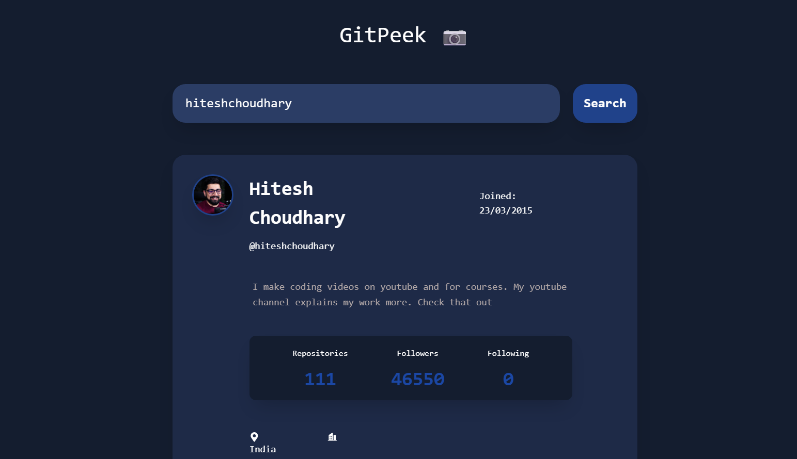

# 👀 GitPeek – GitHub User Finder

**GitPeek** is a fast and simple React-based application to search and preview any GitHub user's public profile. Enter a username and instantly peek into their GitHub stats, repositories, followers, and more!


## 🚀 Features

- 🔍 Search GitHub users by username
- 👤 View public profile details (avatar, bio, location, etc.)
- 📦 See list of public repositories
- 👥 Followers & following counts
- 🔗 Direct link to their GitHub profile
- ⚠️ Graceful error handling (e.g., user not found)
- 📱 Fully responsive design


## 🛠 Tech Stack

- **React.js**
- **Fetch API / Axios**
- **Tailwind CSS** (or any CSS framework you choose)
- **GitHub REST API**

---

## 📁 Project Structure

```bash
gitpeek/
├── public/
├── src/
│   ├── components/     # Reusable UI components
│   ├── pages/          # Home, Profile view
│   ├── App.js
│   └── main.js
├── .env
├── package.json
└── README.md
````


## 📸 Preview

 
 


## 🧑‍💻 Getting Started

```bash
git clone https://github.com/your-username/gitpeek.git
cd gitpeek
npm install
npm run dev   # or npm start (if using CRA)
```

---

## 🌟 Why GitPeek?

GitPeek is perfect for:

* Practicing API integration
* Learning GitHub API
* Creating a portfolio mini-project
* Exploring how state and error handling works in real-world UI

---

## 📜 License

This project is open-source and available under the [MIT License](LICENSE).

---

## 🙌 Credits

Inspired by GitHub itself and the need to instantly explore developer profiles with clean UI and fast interaction.

---

Let me know if you want:

* A custom logo or favicon
* To deploy it live on GitHub Pages or Vercel
* Pagination or repo language filters